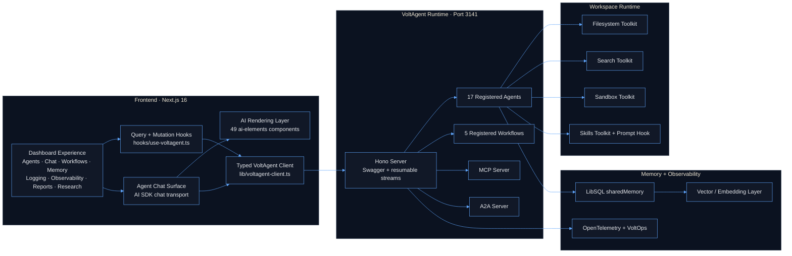
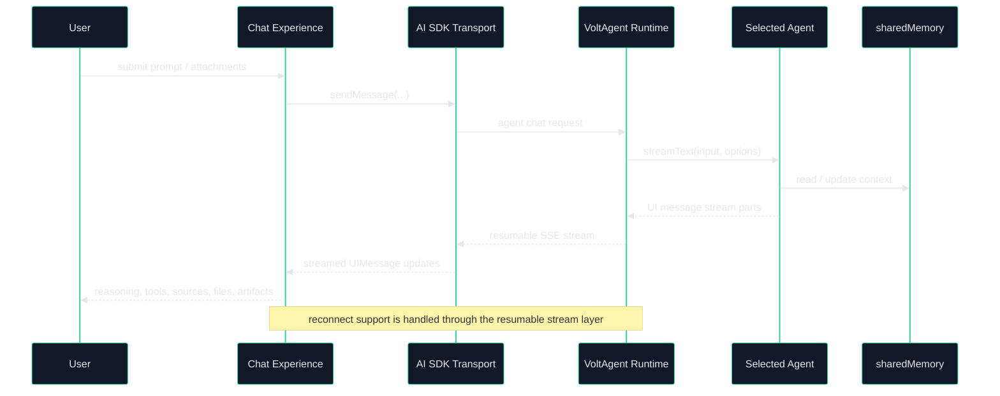
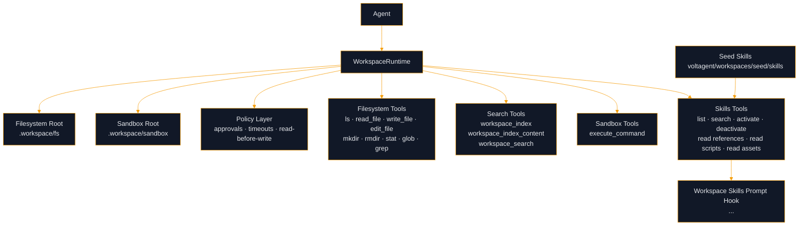

<div align="center">

<a href="https://voltagent.dev/">

</a>

<br/>
<br/>

# Mastervolt Deep Research

### 🧠 Enterprise-grade multi-agent research platform powered by VoltAgent

Built for deep research, analysis, synthesis, reporting, workspace-assisted execution, and rich AI-native frontend experiences.

<br/>

[](LICENSE)
[](https://nodejs.org/)
[](https://www.typescriptlang.org/)
[](https://nextjs.org/)
[](https://react.dev/)
[](https://www.npmjs.com/package/ai)
[](https://voltagent.dev/)
[](https://www.npmjs.com/package/@voltagent/libsql)

[VoltAgent Docs](https://voltagent.dev/docs/) • [VoltOps Platform](https://console.voltagent.dev) • [Discord](https://s.voltagent.dev/discord) • [Repository](https://github.com/ssdeanx/Mastervolt-Deep-Research)

</div>

---

## ✨ Overview

Mastervolt Deep Research is a production-style research system that combines a VoltAgent backend, a Next.js dashboard frontend, a typed VoltAgent client layer, a rich AI rendering system, and a local workspace runtime with skills.

It is designed to support:

- 📚 deep research and source gathering
- 📊 financial and quantitative analysis
- ✅ verification and fact checking
- 🧩 synthesis and report generation
- 💻 coding, review, and workspace-assisted execution
- 🧠 memory-aware multi-agent orchestration
- 🖥️ rich streamed frontend rendering for AI-native UX

### What the current codebase includes

- **17 registered runtime agents**
- **5 registered workflows**
- **30+ backend tool and toolkit modules**
- **4 workspace toolkits**: filesystem, search, sandbox, and skills
- **49 AI UI components** in `components/ai-elements/`
- **LibSQL-backed shared memory** with vector retrieval support
- **OpenTelemetry + VoltOps observability**
- **direct VoltAgent runtime integration** from the frontend client layer

This is no longer a thin prototype. The repository now contains a real frontend, broader runtime tooling, workspace capabilities, skills, resumable streaming support, and a significantly expanded backend surface.

---

## 🚀 Platform Snapshot

### Frontend

- Next.js 16 App Router
- React 19 UI layer
- dashboard application with dedicated research, agent, workflow, memory, logging, observability, and report surfaces
- typed VoltAgent client in `lib/voltagent-client.ts`
- TanStack Query integration in `hooks/use-voltagent.ts`
- AI SDK chat transport for live agent interaction
- rich streamed rendering of tools, reasoning, files, sources, test results, sandboxes, and structured data

### Backend

- VoltAgent runtime hosted with Hono
- resumable stream support
- VoltOps client integration
- OpenTelemetry SDK startup
- MCP server registration
- A2A server registration
- shared workspace runtime initialization at startup
- custom memory-facing endpoints layered into the VoltAgent server

### Workspace Runtime

- contained filesystem operations
- indexing + search over workspace content
- timeboxed sandbox execution
- skill discovery and activation
- prompt-hook injection for active workspace skills
- policy-driven approvals and read-before-write protection

---

## 🏗️ Architecture

### Full System Architecture



### Streaming Interaction Lifecycle



### Workspace + Skills Model



---

## 🖥️ Frontend Experience

### Dashboard Surface

The dashboard currently includes dedicated areas for:

- 🏠 system overview
- 🤖 agent discovery and selection
- 💬 live agent chat
- 🔄 workflow execution and visualization
- 🧠 memory inspection
- 📜 logging
- 📡 observability
- 📝 reports and research surfaces

### Frontend Runtime Design

The frontend is built around three distinct layers:

#### 1. **Typed VoltAgent client**

`lib/voltagent-client.ts` provides strongly typed helpers for:

- agents
- workflows
- tools
- MCP servers, prompts, tools, and resources
- conversations and memory
- observability
- updates
- A2A helpers

#### 2. **Query + mutation hooks**

`hooks/use-voltagent.ts` provides TanStack Query wrappers for runtime access and cache invalidation.

#### 3. **Render-focused chat components**

The chat UI is intentionally split by responsibility:

- `chat-input.tsx` → prompt composition, attachments, model selection, speech input, preview helpers
- `chat-header.tsx` → chat metadata and agent selection UI
- `chat-panel.tsx` → agent/workspace/runtime sidebar details
- `chat-messages.tsx` → **pure rendering layer** for streamed `UIMessage` parts

### Important note about `chat-messages.tsx`

`chat-messages.tsx` is **not a hook-driven data-fetch component**.

It is a **typed renderer** that consumes already-available `UIMessage[]` data and renders:

- text parts
- reasoning parts
- tool invocations
- files and images
- sources
- sandbox output
- file trees
- workspace search/read/listing results
- schemas, snippets, package info, checkpoints, confirmations, and structured data parts

That distinction matters because the frontend architecture is not just “hooks everywhere.” The rendering layer is intentionally separated from the transport/query layer.

### AI UI Component System

The repository currently includes **49 AI-focused components** under `components/ai-elements/`, covering:

- 💬 conversation and message primitives
- 🧠 reasoning and chain-of-thought visualizations
- 🛠️ tool execution panels
- 🖥️ terminal and sandbox rendering
- 📁 file tree and artifact viewers
- 🧪 test result displays
- 📦 package and schema viewers
- 🎤 prompt, speech, and model selection input systems
- 📚 sources, citations, plans, tasks, and queue components

---

## ⚙️ Backend Runtime

### Registered Runtime Agents

The current top-level VoltAgent runtime registers **17 agents**:

- assistant
- support-agent
- satisfaction-judge
- research-coordinator
- writer
- director
- data-analyzer
- data-scientist
- fact-checker
- synthesizer
- scrapper
- coding-agent
- code-reviewer
- deep-research-agent
- research-orchestrator
- news-orchestrator
- content-curator

### Backend Agent Roles

#### 🧠 Orchestration and planning
- `deep-research-agent` → primary orchestrator
- `research-coordinator` → execution planning
- `director` → orchestration quality governance
- `research-orchestrator` / `news-orchestrator` → specialized planning flows

#### 📚 Research and synthesis
- `assistant` → query strategy and discovery
- `scrapper` → source ingestion
- `fact-checker` → verification and confidence scoring
- `synthesizer` → contradiction resolution and integration
- `writer` → publication-ready output generation
- `content-curator` → evidence ranking and curation

#### 📊 Quant and analysis
- `data-analyzer` → analytical interpretation and patterns
- `data-scientist` → statistical and market analysis

#### 💻 Engineering and support
- `coding-agent` → implementation and refactoring
- `code-reviewer` → correctness, security, maintainability review
- `support-agent` → issue resolution guidance
- `satisfaction-judge` → quality/satisfaction scoring

### Registered Workflows

The runtime currently registers **5 workflows**:

- research-assistant-demo
- comprehensive-research
- comprehensive-research-director
- data-pattern-analyzer
- fact-check-synthesis

### Backend Runtime Features

- 🚦 Hono server runtime on **port 3141**
- 📘 Swagger UI enabled
- 🔁 resumable stream adapter enabled
- 📡 VoltOps client integration
- 🧵 OpenTelemetry Node SDK startup
- 🔌 MCP server registration
- 🤝 A2A server initialization with task store
- 🧠 shared workspace runtime initialization at startup
- 💾 custom conversation/message memory endpoints on the VoltAgent server

---

## 🧰 Tooling Surface

The `voltagent/tools/` directory currently contains **30+ tool and toolkit modules** spanning several families.

### 📈 Market and macro data

- stock market toolkit
- crypto market toolkit
- forex market toolkit
- economic data toolkit
- Alpha Vantage toolkit
- financial analysis toolkit
- statistical analysis toolkit
- token analysis toolkit

### 📰 Research, retrieval, and content

- web scraper toolkit
- ArXiv toolkit
- PDF toolkit
- RAG toolkit
- knowledge graph toolkit
- content transformation toolkit
- sentiment analysis toolkit
- news aggregator toolkit
- crypto news toolkit

### 💻 Engineering and diagnostics

- code analysis toolkit
- test toolkit
- git toolkit
- filesystem toolkit
- debug tool
- reasoning tool

### 🔄 Data and visualization

- analyze-data tool
- data conversion toolkit
- data processing toolkit
- visualization toolkit
- semantic utilities
- API integration toolkit
- weather toolkit

---

## 🗂️ Workspace System and Skills

The workspace runtime is now a major backend feature and should be treated as part of the production platform design.

### Workspace toolkits

Current workspace toolkits:

- `filesystem-toolkit.ts`
- `search-toolkit.ts`
- `sandbox-toolkit.ts`
- `skills-toolkit.ts`

### Workspace runtime features

The workspace runtime currently provides:

- contained virtual filesystem access rooted under `.workspace/fs`
- contained sandbox execution rooted under `.workspace/sandbox`
- path normalization and traversal protection
- read-before-write enforcement for sensitive file operations
- configurable tool policy rules for approvals and timeouts
- seeded skill copying on initialization
- workspace search indexing and retrieval
- skills prompt injection through a dedicated hook

### Seeded skills

The current seed tree includes:

- `voltagent/workspaces/seed/skills/common/`
- `voltagent/workspaces/seed/skills/common/data-analysis/`

### Workspace security model

The runtime currently enforces production-oriented guardrails such as:

- path containment
- no traversal via `..` or `~`
- per-tool approval settings
- read-before-write protection
- capped sandbox execution time via `operationTimeoutMs`

---

## 🧠 Memory and Observability

### Memory

The current platform uses:

- LibSQL-backed shared memory
- persistent conversation storage
- vector-backed retrieval support
- typed client helpers for conversation, working-memory, and memory-search operations

### Observability

The runtime currently includes:

- OpenTelemetry SDK node instrumentation
- VoltOps forwarding support
- observability query coverage in the frontend client/hook layer
- dashboard surfaces for runtime logging and observability inspection

---

## 📦 Package Versions

The following versions reflect the current checked-in `package.json`.

| Package | Version |
|---|---:|
| `next` | `^16.1.6` |
| `react` | `^19.2.4` |
| `react-dom` | `^19.2.4` |
| `typescript` | `^5.9.3` |
| `ai` | `^6.0.116` |
| `@ai-sdk/react` | `^3.0.118` |
| `@ai-sdk/google` | `^3.0.43` |
| `@ai-sdk/openai` | `^3.0.41` |
| `@tanstack/react-query` | `^5.90.21` |
| `@voltagent/libsql` | `^2.1.2` |
| `@voltagent/server-core` | `^2.1.10` |
| `@voltagent/server-hono` | `^2.0.7` |
| `@voltagent/resumable-streams` | `^2.0.2` |
| `vitest` | `^4.0.18` |
| `zod` | `^4.1.13` |

### Notable override pins

- `@voltagent/core` → `^2.6.8`
- `ai` → `^6.0.116`
- `react` / `react-dom` → `^19.2.4`

---

## 🧪 Development Commands

These commands are current as defined in `package.json`.

```bash
# VoltAgent backend in watch mode
npm run dev

# Next.js frontend in development
npm run dev:next

# Run both concurrently
npm run dev:test

# Build backend TypeScript
npm run build:volt

# Build Next.js frontend
npm run build:next

# Backend production entrypoint
npm start

# Lint
npm run lint

# Format
npm run prettier

# Test
npm test
```

---

## 🧭 Repository Structure

```bash
Mastervolt-Deep-Research/
├── app/                          # Next.js App Router frontend
│   ├── api/                      # compatibility / local API helpers still in repo
│   └── dashboard/                # dashboard UI surfaces and chat experience
├── components/
│   ├── ai-elements/              # 49 AI-focused rendering components
│   └── ui/                       # shared design system primitives
├── hooks/                        # TanStack Query and runtime hooks
├── lib/                          # typed VoltAgent client and shared utilities
├── memory-bank/                  # project context and progress docs
├── tests/                        # Vitest suites and generated results
├── voltagent/
│   ├── a2a/                      # agent-to-agent runtime integration
│   ├── agents/                   # agent definitions and orchestration
│   ├── config/                   # logger, memory, MCP, observability config
│   ├── tools/                    # research, market, code, and utility toolkits
│   ├── workflows/                # typed workflow chain definitions
│   └── workspaces/               # filesystem/search/sandbox/skills runtime
└── README.md
```

---

## ⚡ Quick Start

### Prerequisites

- Node.js 18+
- npm
- Google Generative AI API key

### Install

```bash
git clone https://github.com/ssdeanx/Mastervolt-Deep-Research.git
cd Mastervolt-Deep-Research
npm install
cp .env.example .env
```

### Minimal Environment

```bash
GOOGLE_GENERATIVE_AI_API_KEY='your_google_generative_ai_api_key_here'

# Optional
# VOLTAGENT_PUBLIC_KEY='your_voltops_public_key'
# VOLTAGENT_SECRET_KEY='your_voltops_secret_key'
# SUPABASE_URL='your_supabase_url'
# SUPABASE_KEY='your_supabase_key'
```

### Run the platform

```bash
# backend
npm run dev

# frontend
npm run dev:next

# both together
npm run dev:test
```

Then open:

- **Frontend:** `http://localhost:3000`
- **VoltAgent runtime:** `http://localhost:3141`

---

## 🔗 Resources

- [VoltAgent Docs](https://voltagent.dev/docs/)
- [VoltOps Platform](https://console.voltagent.dev)
- [Discord Community](https://s.voltagent.dev/discord)
- [GitHub Repository](https://github.com/ssdeanx/Mastervolt-Deep-Research)

---

<div align="center">

**Built on VoltAgent · Extended with Next.js, AI SDK, LibSQL, Workspaces, Skills, and rich AI-native frontend rendering**
</div>
